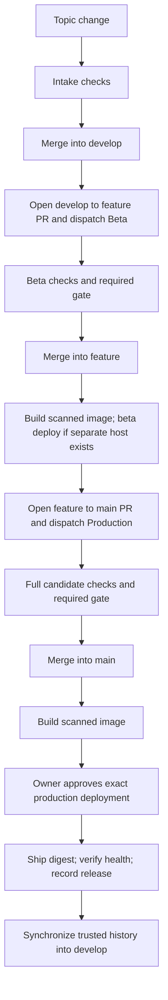

# Delivery sequence and guardrails

Reviewed against `develop` revision `f380bc7` on 2026-09-11. The three-workflow consolidation is committed on develop but does not change the Actions sidebar until it reaches the default branch. This page describes current code; it does not establish current GitHub settings, the deployed revision, or AWS resource state. Historical findings remain in [the original application review](FRONTEND-AND-MEMBERSHIP-REVIEW.md) and [the dated AWS audit](AWS-READONLY-AUDIT-2026-09-09.md).

## Three stages

Only `intake.yml`, `beta.yml`, and `production.yml` belong in `.github/workflows/`. Shared checks and shipping steps live in `.github/actions/`, so they do not add workflow entries. Promotion runs the existing trusted `scripts/promote.py` from the default branch. It uses `GITHUB_TOKEN` and explicit dispatch; no GitHub App, fourth promotion workflow, or new `sync/*` PRs are needed.

| Stage | Candidate verification | After the destination branch moves |
| --- | --- | --- |
| Intake | Topic PR into develop, or dispatch on its topic branch: affected backend/frontend/infra checks and security; no image | Develop push/dispatch advances promotion without repeating tests; never deploys |
| Beta | Dispatch on develop checks the candidate against feature, including image when affected | Feature push/dispatch builds and scans the runtime image; deploys only when a separate beta host is explicitly configured |
| Production | Dispatch on feature checks every boundary for executable changes against main | Main push/dispatch builds and scans the runtime image, then requires production environment approval before shipping |

The beta-host omission is an explicit current allowance, not proof that beta was deployed. `BETA_AWS_INSTANCE_ID` must identify a different host from the production instance `i-09a071e22270b027c`. Beta runtime also requires disabled email delivery and its own data/configuration. Never reuse production as beta.

A simple patch follows the same automatic branch progression. Intake/Beta select affected checks; Production candidate verification remains stricter. The post-merge shipping phase repeats the image scan and container regressions, not the entire candidate suite. Terraform is not run for an ordinary application patch.

## Skips and failure handling

Every selected check must succeed. The aggregate `required-checks` gate rejects missing, failed, or unexpectedly skipped checks. A superseded cancelled run does not start promotion. Each stage explains whether it is verifying or shipping and whether a runtime change exists.

Native pushes compare against their recorded before SHA. A verification dispatch compares against its target branch. A shipping dispatch compares its revision to its first parent; it must not classify all existing application files as newly changed. Missing dispatch history fails classification rather than guessing. Checkout fetches the history needed for these comparisons.

Local composite actions must be present before the runner loads them: every caller checks out first. Promotion is different: its privileged job checks out the default branch and invokes the script directly, so first rollout does not depend on a new composite already existing on main. Jobs default to read-only tokens; only promotion, release, and deployment jobs receive the permissions they need.

Bot promotion PRs use explicit stage dispatch rather than a second approval-gated `pull_request` run. Dependabot retains its real Intake PR checks. A draft, hold label, requested changes, or a closed unmerged candidate stops automatic merging. Merges bind to the checked head and do not arm deferred auto-merge. Removing a hold may require rerunning the corresponding stage. Repository rules remain authoritative; there is no admin bypass in the controller.

Dependabot is limited to monthly grouped npm version updates, with one open version-update PR and major updates excluded. Python automatic version PRs are disabled; actions/Terraform update polling is absent. Security-update PRs have GitHub's separate limits. GitHub-owned Dependabot/Copilot entries are separate from the repository's three workflow files.

## AWS and Terraform operations

Existing application delivery remains CloudFront VPC origin → EC2 → containerized FastAPI/SPA, with SQLite on retained EBS. S3 stores object bytes; permission-filtered database metadata powers the document/project frontend. A VPC is not a substitute for per-member and per-project authorization.

Never redeploy the replacement-sensitive `YucgOutreach-dev` app stack as part of an application release. Shipping uses ECR credentials through the helper, a checked archive and immutable digest, the explicitly bound stack/instance, and SSM. Preflight checks require encrypted volumes, IMDSv2 and no world-open ingress. Restart verifies the retained database mount, takes an online backup, checks non-root write access and supports application rollback. These code checks need real configured IAM permissions and cannot prove live access from local tests.

Production dispatch offers `deliver`, `plan`, `apply`, and `publish-static`. Maintenance operations are main-only and serialized with delivery. Plan/apply use separate protected infrastructure environments and scoped roles; new storage stays disabled by default. Terraform does not automatically adopt CDK-owned resources or change existing compute/database ownership.

A plan binds the reviewed commit, account, region, state bucket/key, target, SHA-256 and creation time. Saved plans and failure diagnostics stay in encrypted private S3, not public Actions artifacts. Apply uses the exact reviewed saved plan, checks freshness, and takes the state lock. Local Terraform validation and mock tests cannot prove live IAM, ownership, quotas or connectivity. Review the full plan and controlled integration evidence before cutover; follow [the Terraform handoff guide](../terraform/README.md).

`publish-static` is useful only after an approved private-S3/CloudFront-origin cutover. It requires a successful Production delivery run for the exact revision and consumes the frontend extracted from that run's image. It does not rebuild an unrelated frontend or run on every application release. Missing/expired artifacts fail; they are not silently rebuilt. Today the container-hosted SPA remains the documented baseline.

## Acceptance and remaining work

- Behavior and authorization tests must cover sender identity, duplicate claims, invitation admission, private/project access, share expiry and quota races. A shared log must never select another member's Gmail credentials.
- Coverage gates apply individually to critical modules; historical whole-backend coverage is only about one third. Passing scanners or coverage does not establish secure code or good UX. Test deletion, coverage exclusions and policy changes need explicit review.
- Studio, invitations, private documents, sender isolation and first-party tracking already exist in source. Avoid rebuilding them from the historical review. Live Gmail/S3 checks still need explicitly authorized controlled accounts and files.
- Browser telemetry requires an authenticated active member and accepts only bounded `page_view` records. Direct API regressions reject forged quota/activity names, oversized details and oversized batches, keeping server reservation events outside the browser namespace.
- Verify the exact hosted stage results before declaring the consolidation operational. The Actions sidebar change requires the deletion commit to reach main. This local review did not push, merge, approve a release, or change GitHub/AWS settings.
- Preserve the current sole-maintainer arrangement: automated checks and explicit production approval. A second independent maintainer is deferred, as requested.

Cost delta for this local consolidation: **$0 in deployed AWS resources**, before credits. A future beta host, S3 versions/backups/requests/egress, ECR retention and Bedrock calls have separate gross costs. Record those assumptions and deltas in review text; credits are temporary offsets, not a lower operating cost or budget cap.
