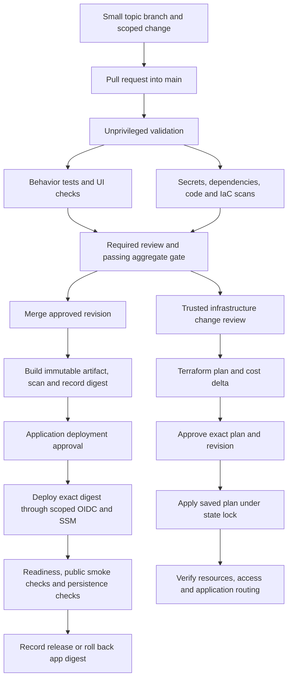

# Delivery sequence and guardrails

> Implementation update: This document preserves the original review findings and proposed architecture. See [the current implementation status](IMPLEMENTATION-STATUS.md) for fixes, final local verification and remaining production gates. Statements below about missing implementation describe the review baseline.

Review date: 2026-09-09. Proposed workflow, not deployed configuration. Complements [the application review](FRONTEND-AND-MEMBERSHIP-REVIEW.md). Repository rules, GitHub plan entitlements and deployed IAM policies were not inspected in this pass.

## Current staged delivery

The single `verify and ship` workflow is gone. Three named workflows share `.github/workflows/verify.yml`:

| Stage | Trigger | Deploys |
| --- | --- | --- |
| **Intake** | PR/push to `develop` | Never |
| **Beta** | PR `develop` → `feature`; push to `feature` | Beta box on runtime pushes |
| **Production** | PR `feature` → `main`; push to `main` | Live box on runtime pushes, after the `production` environment approval |

`scripts/ci_policy.py` chooses which checks a diff requires. A skipped job is a failure unless that policy excluded it. `scripts/promote.py` opens the next promotion PR after a successful push, and merges an eligible PR only after that stage's own required checks pass on the exact head SHA. Holds, drafts, requested changes, and closed-unmerged promotions stop the candidate. Terraform apply and optional static publishing stay on separate reviewed workflows.

Docker no longer stores an ECR password in `~/.docker/config.json`; runners and the box use `amazon-ecr-credential-helper`. Publish-static is not part of every main run: it publishes the frontend already baked into a successful Production image, and only after a manual dispatch with that run ID.

## Review-baseline workflow findings

The 2026-09-09 review described `.github/workflows/ci.yml`, which permitted only develop → feature, develop → main and feature → main PRs and skipped verification on develop pushes. A permanent branch called feature added a promotion step without giving each change an isolated review. Prefer short-lived topic branches into main; if a shared integration environment is necessary, retain develop deliberately rather than keeping both integration branches by default. Changing branch policy requires coordinating repository rules and contributor practice.

Existing positives: read-only default token, AWS OIDC for shipping, serialized main workflow runs, backend scripts, frontend TypeScript/build, and infrastructure TypeScript checks.

Gaps: frontend lint is not run; no visible security/dependency/secret/container scans or visual regression checks; infrastructure is type-checked without a resource-change review. Actions use mutable version tags. Python dependencies mostly have open lower bounds, so repeated builds can resolve different packages. The PR image is discarded and shipping rebuilds another image. No deployment environment approval is declared. The restart script checks whether /data is a directory, not the expected mounted data volume; it replaces the container without application readiness or automatic rollback verification. SSM command completion does not prove a healthy application. The absence of checks here does not establish whether repository-level rules exist elsewhere.

## Target GitHub Actions flow

Keep application shipping and infrastructure applying separate workflows and roles. An app-only change must not trigger Terraform apply. A change needing both declares order and backward compatibility explicitly. Build and scan the merged revision once, then promote that digest; do not deploy an independently rebuilt tag. Frontend artifacts must identify the same release and preserve API compatibility.

Run the full workflow once for pull requests into develop, feature, or main, and once for the final main push that produces release artifacts. Do not repeat the same full browser/container pipeline merely because a develop or feature head was pushed and then opened as a PR. Concurrency cancellation remains useful for superseded PR revisions.

The main workflow opens the protected production deployment only when the merge changes `backend`, `frontend`, `docker/app.Dockerfile`, or `.dockerignore`. Documentation, dependency-policy, workflow-only, and infrastructure-review changes still run required checks but do not request an application deployment. Deployment-script changes take effect with the next runtime release and do not restart the server alone.

Do not expose cloud credentials or secrets to untrusted PR code. Terraform providers, data sources and tooling can execute code: a nominally read-only plan is not safe to run on arbitrary PR changes with AWS credentials. Run static PR checks without credentials; generate the live plan only for a reviewed revision in a trusted workflow. Protect plan artifacts as potentially sensitive and bind approval to commit, plan hash, target account and state. Re-plan and obtain a fresh review when the revision or state changes; never replace an approved saved plan with an unreviewed apply-time plan.

Use full commit SHA action pins with automated update review, minimum job permissions, repository/environment-scoped OIDC trust, isolated ephemeral runners for untrusted work, deployment concurrency, and timeouts. Pass PR-controlled text through environment variables or structured arguments rather than directly interpolating it into shell scripts. Avoid privileged pull_request_target execution of contributor code. These controls follow [GitHub's secure-use guidance](https://docs.github.com/en/actions/reference/security/secure-use).

Require checks and independent review through repository rules; dismiss stale approvals and require the latest revision to pass. Protect workflows, ownership rules, auth, migrations and infrastructure with designated reviewers. Verify environment-protection availability for this repository's GitHub plan; if unavailable, use a restricted, human-triggered release process bound to a reviewed revision. Do not claim an approval gate exists merely because a YAML file names an environment.

## Terraform implementation and ownership

Terraform is the intended infrastructure implementer, not a second controller of CDK-owned resources. No Terraform files currently exist in this repository.

1. Inventory live resource IDs, dependency edges, configuration drift, existing CloudFormation ownership and data-bearing resources. Resolve the known failed/replacement-sensitive stack state before migration. Verify database mount and a restoreable backup first.
2. Prepare a narrowly scoped remote-state bootstrap: private encrypted versioned S3 state, least-privilege access and native S3 state locking (`use_lockfile`). Keep state separate from application document access. Pin Terraform/provider versions and commit the provider lockfile. State and plans must never enter Git or public artifacts. [HashiCorp documents the S3 backend and locking permissions](https://developer.hashicorp.com/terraform/language/backend/s3).
3. Adopt a bounded resource group at a time. For each resource, prepare Terraform configuration/import blocks matching live settings and an explicit CloudFormation retention/removal sequence that relinquishes ownership without deleting the resource. Review dependent outputs, references and deletion/replacement retention. Pause competing deployments during handoff. Import alone does not remove CloudFormation ownership. [Terraform import documentation](https://developer.hashicorp.com/terraform/language/import).
4. Require a no-unintended-change post-import plan. Stop on replacement or deletion of live data, origin, instance or identity resources until separately reviewed. Use prevent_destroy where appropriate, while recognizing removal of configuration can remove that protection; plan policy and human review remain necessary.
5. Make new infrastructure changes only after ownership is established. Keep documented ownership boundaries if some components temporarily remain CDK-managed. Do not run both controllers against the same resources. Track bootstrap state and disaster recovery separately.

Guardrails on plan JSON should reject public data buckets, unexpected ingress, unapproved IAM wildcards, disabled encryption, removal of retention, and unapproved destructive actions. Allow narrowly documented exceptions with owner and expiry; some AWS APIs require wildcard resources. Reject broad policy exemptions. Drift checks should report, not automatically reconcile or destroy resources.

## Quality and security gates for all contributions, including AI-generated code

Passing scanners is evidence, not proof of secure or useful code. Acceptance requires that a reviewer can explain the behavior, permissions, failure modes and operational cost. AI-generated changes receive the same review and cannot approve themselves.

| Gate | Required evidence |
| --- | --- |
| Scope and design | Concrete user problem, acceptance criteria, affected records/permissions, reused components; no unrelated refactor or placeholder feature presented as complete |
| Reproducibility | Locked frontend and backend dependencies, supported pinned runtimes, reviewed updates, deterministic artifact identity |
| Static quality | Frontend lint/type/build, backend lint and focused type checking, action/workflow lint, Terraform fmt/validate/lint once introduced |
| Security analysis | Secret scan, Python/npm dependency audit, code security analysis, container and IaC scans; selected tools pinned and maintained |
| Authorization | Negative tests for member A accessing member B's private records, project boundary violations, revoked users, ordinary users invoking admin APIs, and unauthorized search/export/download |
| Identity and sharing | OAuth state/CSRF protection, verified email invitation binding, replay/expiry checks, session/cookie controls, rate limits, share revocation and short-lived bearer URL behavior |
| Data handling | Parameterized queries, safe rendering of imported content, path/filename handling, constrained uploads, SSRF protection for discovery URLs, no tokens/mail bodies in logs |
| Reliability | Durable job recovery, idempotency, bounded retries, partial failure reporting, migration/restore tests, duplicate-send ambiguity handling |
| Frontend | Browser tests for shared navigation/scrolling, keyboard access and focus, narrow widths, loading/error/empty states; visual baselines independently reviewed |
| Release | Same scanned digest deployed, expected data mount verified, readiness through origin and public route, previous digest retained and rollback rehearsed |

Use a small maintained toolset rather than many overlapping scanners: for example existing ESLint/TypeScript plus Ruff, pip-audit/npm audit, Gitleaks, a code analyzer, and Trivy for image/IaC scanning. Verify licenses and hosted-feature entitlements before choosing integrations; open-source CLI tools still consume CI minutes. Require remediation of introduced serious findings. Baseline existing debt with owned deadlines so the project can improve without silently grandfathering everything. Suppressions must identify the exact finding, justification, reviewer and expiry.

Tests should exercise user-visible contracts and realistic failure cases, not simply repeat the implementation. Auth/storage tests need adversarial identities and direct API requests, not only hidden buttons. UI screenshots must never be automatically accepted just to turn checks green. Gate changes, test deletion, skipped tests and coverage exclusions deserve explicit review. Keep a stable aggregate required job so path filtering cannot silently omit mandatory checks.

Deployment checks must verify /data is the expected mounted filesystem before stopping the old container. Use backward-compatible expand/contract migrations and a consistent pre-migration backup. Roll back an application image only while its schema remains compatible; database rollback or restore is a separately reviewed recovery action. Do not automatically resend mail during smoke tests. Test Gmail delivery with explicitly authorized controlled accounts.

## Ordered implementation

### Release-blocking sender isolation

Additional source review found actual sender selection risks, not merely hypothetical pooled-log concerns:

- `campaigns.py:drain_campaign` accepts a caller-supplied user ID without checking it against campaign sender ownership. The manual send endpoint passes the current viewer's ID, while the scheduled drain uses `released_by`.
- Releasing/resuming a campaign updates `released_by` to the acting user, potentially changing future sender selection.
- `follow_up_job.py` selects the sequence creator's Gmail account rather than the initial message's sender and updates the aggregate recipient sender field afterward.
- Campaign creation currently records no owner. Although its handler uses optional authentication, `main.py` requires authentication at router inclusion; this is not an anonymous-access finding. Existing historical ownership cannot safely be inferred from whoever next opens a campaign.

These findings are not fixed by this review. Block production rollout of expanded shared sending until the following contract is implemented and tested:

1. Record authenticated campaign owner, explicitly authorized sender account, release actor and individual-message sender separately. Resolve credentials solely from the persisted authorized sender; never from the current viewer, template/sequence author, pooled log, recipient assignee or latest active account. Capture sender email/account identity at send time for historical attribution.
2. Bind each queued send to an immutable sender and recipient snapshot. Once released, pause/resume/retry cannot change that binding. Changing sender requires an explicit new reviewed release, with unsent work handled transactionally. Fail closed for missing or ambiguous legacy ownership; reconcile from reliable history and explicit owner confirmation.
3. Follow-ups inherit the original outreach conversation's authorized sender. A shared sequence is reusable content, not mailbox delegation. On disconnected/revoked Gmail access or inactive membership, block the affected work and display the reason; never fall back to another member or SMTP account.
4. Enforce authorization on every campaign mutation: content edits, recipient changes, release, pause/resume, retry, deletion and direct send endpoints. A permitted team viewer must not be able to change what another member's queue sends. Default to no delegated sending, including administrators; any future delegation requires explicit, auditable authorization.
5. Use durable atomic claims/leases so concurrent workers, pause/resume and retries cannot reclaim an in-flight message and send it twice. Keep uncertain remote-send outcomes out of blind retries. Sender isolation and duplicate prevention are distinct checks.
6. Keep reporting read-only with respect to delivery. Display member, actual sending account, recipient/organization, project/campaign, sent time and observed status. Separate unique recipients, initial messages and follow-ups; show explicit date range and last successful sync. Shared counts come from confirmed message records, not page views, draft ownership or release-button clicks. Historical totals must not change attribution when a project is reassigned.
7. Keep message bodies, OAuth credentials and unrelated mailbox contents out of shared activity views. Apply club/project permissions to aggregate and drill-down queries. The intended shared record answers who contacted whom, when, and how much outreach was completed.

Required regression scenarios: member B cannot release, alter, retry or manually drain A's work; scheduled draining still selects A after B views the campaign; a B-authored sequence used by A follows up as A; A disconnecting blocks A's queue without fallback; reassignment cannot rewrite sender history; parallel workers and pause/resume do not duplicate a claim; per-member totals reconcile with individual confirmed messages. Mock credentials and Gmail transport with two distinct accounts and assert both the selected account and absence of unauthorized send calls.

1. Harden delivery and sender isolation first: implement the release-blocking contract above, reproducible dependencies, meaningful checks, protected review, digest-based release, mount/readiness checks and rollback. Establish a manageable baseline of existing failures rather than disabling checks.
2. Fix the shared shell, backdrop, scroll policy and common headers; capture browser acceptance across all current pages.
3. Implement real invitations, membership enforcement and separate Gmail connection; prove access-boundary tests.
4. Add connected project/document metadata and authorization, durable imports/jobs and frontend progress/provenance.
5. Prepare Terraform bootstrap and resource-by-resource CDK handoff; apply only reviewed plans. This preparation can proceed alongside app work, but migration must not block safe app-only shipping.
6. Wire private S3 file transfers, tested backups, retention and optional static frontend origin under the established infrastructure owner.
7. Validate real club workloads, review text cost deltas, then consider compute/database scaling from measured need.

For each change, append a short cost line to the PR and conversation: previous estimate → proposed estimate; recurring delta; usage assumptions; one-time cost; approval status. Account for versions/backups, requests, downloads, logs, AI/discovery usage and CI artifacts/minutes. Show gross cost before credits; unknown is not zero. This is an estimate ledger, not an AWS spending cap or a new billing service. No separate budget document is required.
