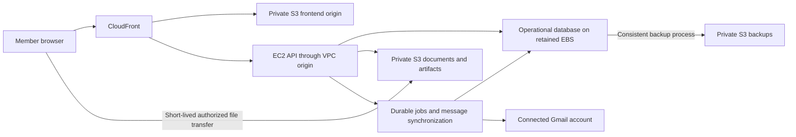

# Frontend and membership review — 2026-09-09

> Implementation update: This document preserves the original review findings and proposed architecture. See [the current implementation status](IMPLEMENTATION-STATUS.md) for fixes, final local verification and remaining production gates. Statements below about missing implementation describe the review baseline.

Delivery, Terraform and security implementation details: [delivery guardrails](DELIVERY-GUARDRAILS.md). Cost updates remain short text in the conversation rather than a separate budget document.

Scope: supplied deployed Admin screenshot and current local source. Local changes are in progress; the screenshot does not establish which local changes are deployed. This review does not deploy infrastructure or send invitations.

## Priority 1: make membership behavior match the interface

- `frontend/src/pages/Admin.tsx` reports “User invited,” but `backend/app/routers/admin.py` only inserts a placeholder user. No invitation email, token, expiry, delivery state, or acceptance exists in that endpoint.
- `backend/app/routers/auth.py` creates a standard user on first Yale Google login. Consequently, the current invitation list is not an admission gate.
- Login currently requests Gmail read/send permissions together with identity. Separate club sign-in from an optional Connect Gmail step for outreach.
- Admin data fetch failures are converted to empty arrays. A failed request can look like an empty membership list; show an error and Retry instead.

Keep Administration → Members as the invitation entry point. Provide Members and Invitations views; allow paste/CSV of email addresses, initial role and project assignments, duplicate validation, and a review step. Explicit Send invitations should call the backend and report per-recipient success/failure. Creating a roster entry must not claim an email was sent.

Persist invitation lifecycle separately from user records: pending, accepted, expired, revoked. Track delivery attempts separately so “sent” is not confused with acceptance. Store a hash of an expiring, single-use token. On acceptance, require a verified Google email matching the invited address and atomically consume the invitation and activate membership. Define treatment of existing accounts before enabling admission enforcement.

Project assignment and file access must be enforced in the API. Existing project membership and object catalog tables are useful foundations, but do not establish a complete document permission model. Define owner, project, club and explicit external-sharing permissions for every list/search/download/write operation. A VPC does not substitute for those checks.

## Priority 2: organize around member tasks

Current navigation mixes actions, periods, and concepts: Week, Studio/Write, Send, Pipeline/CRM, Find and Stats. Desktop/mobile naming also changes. Adopt one label per destination.

Proposed structure:

| Main destination | Contents |
| --- | --- |
| Home | My tasks, recent projects, outreach requiring attention |
| Outreach | Prospects, Drafts, Campaigns, Pipeline, Results; weekly view within outreach |
| Projects | Assigned projects, members and project documents |
| Documents | Personal files, shared files, club library and document register |
| Administration | Members and invitations, project administration, activity log, technical settings |

Only expose destinations with implemented functionality. Move personal two-factor authentication into account settings. Place API keys, storage diagnostics and operations tooling under technical settings rather than equal-priority tabs beside Members. Keep exports available as secondary actions.

Replace implementation-oriented copy such as “send drain,” “Haiku on Bedrock,” and “Slate, comb, write, release” with the task and its outcome. Audit privacy statements: the Operations panel claims local Ollama processing and training; those claims must be verified against the actual backend path before being retained.

## Priority 3: establish a consistent page system

The screenshot has competing top navigation, admin tabs, team sidebar and a floating control; a decorative gray panel and constrained content leave substantial unused space. Local sidebar/overlay removals already address part of that screenshot, but need deployment and visual verification.

Use one shell, a consistent page header, one primary action, restrained backgrounds, and shared forms/tables/status components. For Members, use “Members & invitations” as the title and “Invite members” as the primary action; move bulk exports to a secondary menu. Add search, role/project filters and clear pending/active states. Allow wide tables sufficient space and responsive overflow.

Consolidate the stylesheet incrementally: broad global overrides and repeated `!important` radius/color rules currently compete with newer UI primitives. Avoid another layer of overrides. Replace page-specific variants as each page is migrated.

## Shared shell takes priority over individual page decoration

## Multi-user architecture review: correctness before scaling

The architecture must separate authenticated identity, resource ownership, collaboration permissions, job execution identity and reporting attribution. A shared database is appropriate; globally mutable records without these boundaries are not. This applies even with two members on one server, before storage or CPU capacity becomes a concern.

Additional source findings:

| Priority | Finding | Required correction |
| --- | --- | --- |
| Blocker | Campaign mutation handlers select by ID without owner/project authorization; contact clear-all and deletion similarly lack an administrative or resource-level check. Router login protection exists but is insufficient. | Central authorization policy applied to every read, mutation, export and background action; restrict destructive club-wide operations. |
| Blocker | Sender choice varies between manual sends, scheduled releases and follow-ups. | Immutable authorized sender per queued message, with account-bound retries and follow-ups; see delivery guardrails. |
| High | Signature settings are global key/value records used by sending jobs. | Separate club defaults from member signatures and account settings; capture the intended signature in the reviewed send payload. |
| High | Attachment library lists/downloads are shared across authenticated users and lack project/owner scope. | Keep explicitly shared club assets separate from private/project documents; enforce permissions when attaching files to outgoing email as well as downloading them. |
| High | Campaign pause resets all sending rows to pending while an existing send may still be running. | Pause future claims; retain in-flight ownership until completion or controlled recovery. Use atomic claims with lease/attempt identity and conditional finalization. |
| High | Schedulers start in application lifespan; several wrappers schedule tasks and return before work completes. Gmail locks are in memory. | Establish durable job claims and one scheduler authority; prevent overlapping execution across ticks/processes and recover interrupted work. In-process locks alone cannot protect multiple workers. |
| High | Auth database lookup catches broad exceptions and retries without checking is_active. | Fail closed on schema/database errors; migrate schemas explicitly rather than bypassing disabled-account enforcement. |
| High | Aggregate analytics queries are not member/project-scoped. | Define intentionally shared reporting permissions and separate per-sender facts from project/club aggregates. Authenticate and authorize drill-downs independently. |

This is a source review, not a completed penetration test or concurrency load test. SQLite WAL and a busy timeout exist, but they do not implement authorization, prevent logical lost updates, or make email side effects transactional.

### Required data and execution contract

- **Private scope:** identity credentials, personal settings, private documents and personal drafts. Explicit owner/account foreign keys; requester cannot choose another owner merely by sending an ID.
- **Project scope:** shared contacts, documents and work carry project IDs and membership-based capabilities. Sharing grants read/edit rights deliberately; it does not grant Gmail sending authority.
- **Club scope:** approved shared library and outreach summaries. Preserve actor, sender, owner and project as distinct fields. Club administrators do not implicitly inherit mailbox authority.
- **Execution scope:** each durable job stores owner/authorized account, immutable payload or payload version, idempotency key, state, attempt and lease identity. Validate authorization before claiming and immediately before irreversible effects, with documented handling of revocation races. Never derive execution identity from a shared log or latest viewer.
- **Reporting scope:** confirmed message facts drive counts. Deduplicate event ingestion and aggregate at the intended grain so joins do not multiply sends. Distinguish unique people contacted from message count. Reassignment must not rewrite historic attribution; record corrections explicitly.

Concurrent editing needs version-checked updates (conflict responses rather than silent overwrite), transactional membership/share changes and uniqueness constraints for imports, invitations and job identities. Do not hold database write locks during Gmail or S3 network requests. A Gmail send and database commit cannot be one transaction: ambiguous outcomes require reconciliation, not automatic retry claims of exactly-once delivery.

Caches, frontend query keys and browser-persisted data must include the relevant account/project scope. Clear private cached state on logout/account switch; do not place authenticated API responses in shared CDN caches. Scope live-update subscriptions and backend search before returning results. Audit these paths as part of implementation rather than assuming route guards cover them.

### Proof required before club rollout

Use at least two members, separate Gmail transports, an administrator, two projects and private/shared documents. Exercise HTTP routes through the real authentication dependencies, not only direct function calls. Verify that B cannot edit/delete/send A's work, authorized summaries remain visible, private search/export results stay private, and revoked access is denied. Run simultaneous edits, imports, queue claims and pause/resume; kill/restart a worker between remote send and local completion; reconcile counts after duplicate events. Add cross-account frontend cache tests.

The first implementation milestone is a complete endpoint/operation permission matrix and ownership migration plan, followed by server-enforced policy and these negative/concurrency tests. Reconcile legacy records without assigning them to the first user who touches them. Keep layout work progressing locally, but do not roll out expanded multi-user operations before these blockers are resolved. Neither Terraform, a VPC nor changing databases supplies these application guarantees automatically.

## Shared layout implementation contract

The user's primary design concern is consistency across the whole application. Establish the following contract before migrating individual pages:

- One document scroll for normal pages. The global header stays at the same viewport position; section tabs stay in normal flow. Reserve internal scrolling for explicitly bounded interfaces such as a document preview or a long selection dialog.
- Remove the authenticated workspace's fixed photo backdrop. `index.css` currently creates a viewport-wide fixed pseudo-element on `.app-shell-main-inner` and makes the shell transparent. Use an opaque neutral workspace surface; retain photography only where intentionally useful, such as a public landing page.
- Replace default photo-based page headers with one plain header component. Admin and Profile currently use independent headings while other pages receive a photo strip through `PageHeader`.
- Standardize content width, gutters, heading sizes, action placement, tab style, table density and empty/error/loading states. A wide records page can use more width than a reading page, but both must share the same grid and header alignment.
- Keep navigation labels and ordering stable at responsive breakpoints. A mobile drawer may change presentation, not destination names.
- Define route scroll behavior: new destination starts at its heading; returning to a list restores its filters and position where practical. Avoid decorative route motion that makes the navigation appear to jump.

Source evidence: `AppShell.tsx` uses `min-h-screen` with an `overflow-auto` main region, while `AppShellHeader.tsx` uses sticky positioning. Studio additionally has several independently scrolling viewport-height panels. These are concrete sources of competing scroll behavior, but the exact reported movement still needs reproduction in a browser; source inspection alone does not prove its precise trigger.

Visual acceptance: review every destination at desktop and narrow widths, short and long content, zoomed text, open menus, modal dialogs and back navigation. Confirm one normal-page vertical scrollbar, no menu jumps or obscured focused controls, no workspace photo backdrop, consistent headers, and no mobile horizontal overflow except clearly bounded tables.

## Club data should appear as connected records

Systematic collection means preserving useful operational records and their provenance, not indiscriminately collecting mailbox contents or member activity. Keep identity access separate from optional Gmail permissions, and define visibility and retention for each record type.

| Record | Durable relationships and provenance | Frontend representation |
| --- | --- | --- |
| Members and invitations | Verified identity, club role, project membership, invitation and acceptance timestamps | Member directory, pending invitations, project team |
| Organizations and contacts | Organization/contact IDs, source, imported/discovered time, last validation, responsible member | Searchable prospects, contact details, duplicate review |
| Projects | Client, members, milestones, linked contacts, documents and campaigns | Project overview bringing related work together |
| Documents and versions | Owner, project, visibility, file metadata, immutable version reference and upload source | Document register with search, versions, sharing state and activity |
| Outreach | Campaign, recipient, individual message, timestamped events and sync state | Campaign history and contact timeline; distinguish open detected, reply, delivery delay and bounce |
| Imports and background work | Job ID, initiator, source, progress, errors, retry state and completion | Persistent activity/status views rather than a toast that disappears |
| Audit records | Actor, action, target and timestamp with defined access and retention | Administrative activity log; limited relevant activity on project pages |

The database should be the source of truth for relationships and permissions. S3 holds file contents and large source artifacts. Frontend searches use paginated, authorized API queries against indexed metadata; browsing an S3 prefix is not the application's search or access-control model. Reuse stable IDs so one contact, document or project does not become unrelated copies in separate tools. Surface source, last update and synchronization failures beside affected data.

## AWS wiring: existing baseline and staged target

Baseline comes from the separately recorded [read-only AWS audit](AWS-READONLY-AUDIT-2026-09-09.md), not a fresh live inspection in this review. Current local infrastructure code was also inspected. The live system routes CloudFront through a VPC origin to one EC2 instance, with an attached data volume and an existing private S3 catalog. Frontend and API currently share the EC2 origin. Guest mount and restore behavior remain unverified.

Proposed target, not yet deployed:

Wiring requirements:

1. **Frontend delivery:** prepare a private static S3 origin with CloudFront origin access control, hashed-asset caching and short-lived entry-document caching. Preserve API/OAuth/tracking path routing to EC2; never apply SPA fallback or shared caching to private API responses. Confirm actual route prefixes before changing behaviors.
2. **API and identity:** retain the existing EC2 role and VPC-origin approach. Google establishes identity; the database establishes club/project permissions. Keep secrets server-side and scope infrastructure permissions to their tasks. Verify direct-origin access restrictions and runtime public URL configuration.
3. **Document transfer:** authorize uploads and downloads in the backend. Create pending metadata before upload, issue constrained short-lived transfer authorization, then verify completion/size/type before publishing the document record. Support large transfers without buffering entire files through the API. Clean up abandoned uploads and handle database/object reconciliation.
4. **Durability:** identify and verify the authoritative database mount. Prepare consistent SQLite online backups, matching document-version references, retention and a tested restore procedure. Define acceptable data loss and recovery time before choosing frequency. Retained EBS alone is not a backup.
5. **Retention:** separate durable member/project documents from temporary discovery artifacts and exports. Existing catalog rules expire `exports/` and `discovery/` after 30 days; do not place authoritative project records there. Current non-production CDK permits catalog auto-deletion on stack destruction; a deployment containing real club records needs an explicit retention policy before stack changes.
6. **Background execution:** keep job state durable, make retryable processing idempotent, bound concurrency and expose progress. An in-process background task by itself is not a durable queue. Account for restart recovery and the ambiguity of a mail send that succeeded remotely before its local result was saved. Do not add a paid queue/worker fleet solely because it appears in a generic architecture template.
7. **Operations:** expose last successful sync, failed work and upload progress to members; expose backup age, storage growth and service health to admins. Collect bounded logs and useful latency, memory, disk and database-lock metrics. Review gross AWS spend before credits and configure alerts as a separately approved change.

Scaling boundaries: S3 file storage can grow independently of the always-on server, but SQLite and a single EC2 instance remain a single-host availability and write-concurrency boundary. Begin with pagination, indexes, direct file transfers and measured workloads. Resize compute only from representative memory/CPU/latency evidence. If concurrent writes, recovery requirements or multiple API replicas justify it, plan a PostgreSQL migration and independent workers; do not claim additional EC2 replicas can safely share the current SQLite setup. Seventy registered members alone is not a capacity estimate: concurrent activity, file volume and background jobs determine demand.

No new infrastructure is authorized by this review. Prepare separate deployment diffs, cost estimates, rollback and data-preservation steps for static hosting, storage retention, backups and any compute/database change. Resolve the existing stack's replacement-sensitive update failures before infrastructure rollout.

## Implementation sequence and acceptance

First establish and verify the shared shell/scroll/header contract above. Then carry the functional sequence below through those same components; avoid polishing each page independently.

1. Implement invitation persistence, send workflow and admission enforcement together. Verify no-invite rejection, matching/mismatched identities, duplicate sends, expiry, revocation, one-time acceptance, and existing-member compatibility. Test sending with a fake transport before any authorized real send.
2. Normalize navigation, titles and plain-language copy across desktop/mobile. Reuse the same destination metadata for navigation and page headers.
3. Rebuild Members first as the reference page, including loading, errors, empty results, keyboard focus, narrow layouts, long emails and repeated-click protection.
4. Apply the same components to Projects, Documents and Outreach. Implement document authorization before exposing sharing controls; test cross-member access denial and each intended sharing scope.
5. Verify deployed behavior separately from local builds, including actual invitation delivery, OAuth callback and mobile rendering.

These frontend and membership changes fit the existing backend/database architecture; they do not inherently require another paid AWS service. Keep S3 private, authorize file access in the backend, and use short-lived download/upload URLs where appropriate. Storage migration and static frontend hosting remain separate infrastructure work requiring their own concrete deployment review.
