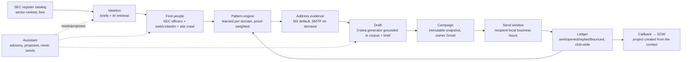

# Outreach platform strategy: from the manual director workflow to one system

Status: design proposal, 2026-09-19. Grounded in source and in live production
checks run the same day. Nothing here is asserted to work unless it was
verified against the running box. See "What was verified live" at the end.

## 1. The workflow this replaces

How a Director of Client Affairs actually runs outreach today, step by step,
and what each step costs in effort or risk:

| # | Manual step | Tool today | Where it breaks |
| --- | --- | --- | --- |
| 1 | Come up with a few companies to target | Head, group chat | No systematic source; depends on who is in the room |
| 2 | Look up the company's email format | Apollo (free tier) | Manual, per company, rate-limited, the club does not pay for it |
| 3 | Extrapolate `first.last@domain` for named people | Head + Apollo | Names come from LinkedIn by hand; guesses are unverified |
| 4 | Draft the email around ~3 ideas YUCG could deliver | Docs | Ideas are re-derived each time; no memory of what worked |
| 5 | Confirm addresses to avoid bounces | Nothing reliable | Bounces damage the sender's Gmail reputation for everyone |
| 6 | Save contacts and status | Google Sheets | Per-director copies; no club-wide "who has been contacted" |
| 7 | Send | YAMM mail merge | Sends at whatever time the director clicks; no follow-up ledger |
| 8 | SOW on a callback | Docs | Disconnected from the contact record that produced the call |

The through-line: **the hard part is steps 2, 3 and 5 - real people, real
addresses, low bounce rate.** Everything else is bookkeeping around that.

## 2. What already exists in this codebase (and its real state)

Most of this pipeline is already built. The gap is not features; it is that
several load-bearing pieces were silently dead until today, so members
experienced "Find people returns nothing" and reasonably concluded the
system does not work.

| Manual step | Existing component | State as of 2026-09-19 |
| --- | --- | --- |
| 1 Company ideas | `research_service.py` briefs (sector-driven, sourced); `yucg_ollama_recommender.py` "Refresh with AI" over the prospect spreadsheet + YUCG website corpus | Recommender was **dead** (corpus never shipped in the image; then the prompt exceeded the LLM's 24k-char limit). Both fixed and verified live today: 5 cited recommendations. |
| 2 Email format | `company_email_cache.py` learns per-domain patterns from every verified sample; `get_company_pattern`/`set_company_pattern` assistant tools | Working. It is the Apollo replacement, and it improves with use. |
| 3 Real people | `yucgoutreach_discovery.py` orchestrator: website crawl (`contact_scraper.py`) + web/LinkedIn search (`web_contact_discovery.py`) + SEC officer roster (`roster_watch.py`, `roster_email.py`) | Web search was **dead** (self-hosted Firecrawl bot-blocked, 0 results) - replaced by TinyFish via Monid, free. SEC roster was **dead** (EDGAR 403s the placeholder User-Agent) - fixed by `SEC_CONTACT_EMAIL`. Verified: Disney 34 saved, McKinsey 11, Apple 7 real officers. |
| 5 Bounce avoidance | `email_verifier.py` (MX now, optional SMTP RCPT), `contact_verify_pipeline.py`, `contact_ai_review.py` | Working as designed at `INBOX_VERIFY_MODE=mx`. See section 4.3 for why full SMTP is not the default. |
| 6 Club-wide record | `contacts` (UNIQUE email), `campaign_contacts` (`sent_at`, `opened_at`, `replied_at`, UNIQUE per campaign), `email_events`, `outreach_messages` | Working. This already is the shared Google Sheet, with a send ledger Sheets cannot provide. |
| 7 Send | Campaigns → immutable dispatch snapshot → owner's own Gmail; follow-up job | Working. **No send-time scheduling** by recipient timezone - a real gap. |
| 8 SOW | Projects + document register | Working, but not linked from a replied contact - a real gap. |
| Advisory layer | `assistant_operator.py` with read tools (`search_contacts`, `recommend_companies`, `get_company_pattern`, `predict_email`, ...) and proposed actions (`start_find_people`, `import_run_to_contacts`) | Working. It is the right place for the "advisory" surface; it already proposes rather than acts. |

## 3. Decisions (including where the instinct is wrong)

These are the calls that shape everything below. Each has a reason; each can
be overruled, but not silently.

**3.1 Keep SQLite on the box as the club warehouse. Do not introduce Athena or S3-as-database.**
The ask was "Athena or S3, whichever runs free, to hold club-wide targets."
That problem is already solved: `contacts`/`campaign_contacts` on the retained
EBS volume *is* the club-wide store, every member sees the same rows, and it
has a send ledger. Athena is billed per query scanned and needs a Glue
catalog and Parquet layout for anything beyond toy scale; S3 objects are not
a transactional database (no UNIQUE email, no "did anyone already email this
person" without building an index). Both would add cost and a second source
of truth for ~70 members and a few thousand contacts, which is exactly the
scale a single SQLite file handles trivially. This matches the standing rule
in `PRODUCT-SYSTEM-MAP.md`: move transactional state only after measured
concurrency requires it. What S3 *is* right for: immutable bytes (documents,
exports) - already how it is used.

**3.2 Do not scrape Apollo. Replace what Apollo was used for.**
Automated scraping of Apollo violates its terms and risks the club's
accounts. It was only ever used for two things - the email pattern and a few
names - and both now have free, legitimate sources in the system: learned
patterns (`company_email_cache`) and SEC/web/LinkedIn discovery. The right
move is to make those visibly good, not to automate a ToS violation.

**3.3 The SEC register is the backbone for company ideation and leadership. It is free and now actually reachable.**
SEC EDGAR publishes every public company (`company_tickers.json`, SIC codes
via submissions) and every officer (Forms 3/4/5, 10-K signatures). That is
the "full register of companies ranked by category" the ask describes, at
zero cost, with no ToS problem. `roster_watch.py` already knows how to read
it. What is missing is the *front door*: a browsable, sector-ranked catalog
of that register, and AI retrieval over it. See 4.1.

**3.4 Companies House (UK officers) stays off until a key exists.**
`COMPANIES_HOUSE_API_KEY` is unset in production, so UK companies never get
officers. The key is free but requires a human to register at
developer.company-information.service.gov.uk. This cannot be done on a
member's behalf. Until then, UK targets fall back to web/LinkedIn only, and
the UI should say so rather than silently returning fewer people.

**3.5 Bounce avoidance: MX by default, SMTP on demand, replies as ground truth.**
Full SMTP RCPT probing from a residential-class EC2 IP is slow, frequently
blocked, and can itself get the box's IP listed. `INBOX_VERIFY_MODE=mx` is
the correct default: it rejects the addresses that *cannot* work (bad
syntax, no mail route) and labels the rest `likely_valid`, which is honest.
The real bounce-rate lever is not a harder pre-check; it is the loop that
already exists in `roster_email.apply_mailbox_proof`: a bounce decays the
learned pattern for that domain, a reply up-weights it. What is missing is
making that loop *visible* so a director can see "this pattern has a 92%
reply-or-no-bounce rate at this company" before sending. See 4.3.

**3.6 Timezone-aware sending is worth building, with a conservative location source.**
The ask: infer each contact's location from LinkedIn and send when they are
likely at their desk. Feasible: TinyFish search snippets for a LinkedIn
profile routinely include a city ("Orlando, Florida"), and SEC filings carry
business addresses. The rule should be *company HQ timezone by default,
per-person override only when a location was actually observed*, never a
guess. One box, one scheduler: this is a `send_after` column on the dispatch
snapshot honoured by the existing drain, not a new service. See 4.4.

**3.7 One box, one image, GitHub Actions → ECR → SSM. Nothing here changes that.**
Every item below is a table, a background job in the existing drain loop, a
router, or a page. No Lambda, no second database, no new hosting.

## 4. Target design, stage by stage

### 4.1 Company ideation: the SEC register as a catalog

Today `research_service` briefs and the spreadsheet recommender both work,
but the *universe* they draw from is the hand-maintained
`YUCG_Prospect_List.xlsx`. Replace the universe, keep the ranking.

- New table `sec_companies` (`cik`, `ticker`, `name`, `sic_code`, `sic_label`,
  `state`, `exchange`, `last_filing_at`), refreshed weekly by a job in the
  existing drain loop from `company_tickers.json` + submissions metadata.
  ~10k rows; trivial for SQLite.
- Sector ranking = SIC division/major group, plus a YUCG fit score computed
  the same way `prospect_coordinator.score_prospect` does today (Yale hook,
  contact type, incentive), so the spreadsheet and the register rank on one
  scale.
- "AI retrieval based on sector": extend `recommend_companies` so a brief's
  industries map to SIC groups first, then Haiku ranks the top-N *within the
  register*, citing the filing that shows the trigger (a new CFO, a
  restructuring, a segment note). The corpus grounding stays exactly as it
  is; only the candidate pool changes.
- UI: the "Live company recommendations" strip becomes a page: filter by
  sector / state / size, see fit score and the last filing, one click to
  "Find people here". The existing `/scraper?view=company` route is the
  landing.

Acceptance: a director picks "Entertainment - Major Studio", sees Disney,
Warner, Paramount ranked with a cited reason each, and starts Find people
without typing a company name.

### 4.2 Finding real people: make the three sources visible and complete

The orchestrator already merges site crawl + web/LinkedIn + SEC roster.
After today's fixes all three produce. Remaining work is coverage and
transparency:

- **Coverage.** TinyFish pagination is in (25 results/query vs 8-10). Next:
  add two query shapes that LinkedIn indexes well and the current set misses
  - `"<Company>" "<title hint>" site:linkedin.com/in` per hint token, and
  a news-corpus query (`domain_type=news`, which TinyFish supports) for
  "appointed / named / joins" to catch recent hires with current titles.
- **Provenance in the UI.** Each prospect row should show its source badge
  (SEC filing / LinkedIn / company site) and, for SEC, the filing link. A
  director trusts an officer from a Form 4 differently from a regex hit in
  a snippet. The data is already in `evidence_json`; it is just not shown.
- **Honest empty states.** When Companies House is unconfigured, or a
  company is private (no CIK), say which source was skipped and why. The
  `roster_note` field already carries this; surface it.
- **Sizing.** `max_prospects` default 250 is fine; the real constraint is
  TinyFish's 500 searches/hour shared by the club. Keep the per-member and
  club quotas in `generation_policy.py`; show remaining quota in Admin →
  Operations next to the search self-test that already exists.

Acceptance: Disney run shows ≥30 people, each with a source badge; an
officer row links to its SEC filing; a UK company run says "Companies House
not configured" instead of a smaller silent number.

### 4.3 Email pattern and bounce avoidance: close the loop and show it

- **Pattern confidence, visibly.** `company_email_cache` already stores
  verified samples and decays on bounces. Add a per-domain confidence
  summary (samples, replies, bounces, last proof) and show it in the draft
  address status and on the company page. "first.last - 14 samples, 2
  replies, 0 bounces" is the confirmation a director needs before sending.
- **SMTP on demand, not by default.** Keep `mx` as the mode. Offer "Deep
  check this campaign's addresses" as an explicit, rate-limited action that
  runs the RCPT probe through the existing semaphore, records catch-all vs
  selective per domain, and downgrades or removes rejected recipients
  before release. Bounded, opt-in, and it feeds the same proof table.
- **Bounce → automatic remediation.** On a hard bounce event, mark the
  contact's address `bounced`, decay the pattern (already), and *propose*
  the next-best pattern for that person as a draft correction in the
  campaign detail, instead of leaving the row red.

Acceptance: a campaign release screen shows, per recipient, MX status,
pattern confidence, and (if deep-checked) mailbox verdict; a bounce produces
a suggested corrected address within the same campaign view.

### 4.4 Sending: recipient-local windows, one scheduler

- Add `send_after` (UTC) to the dispatch snapshot. The existing drain
  already claims messages one at a time; it just also checks
  `send_after <= now`.
- Timezone resolution order: observed person location (from a LinkedIn
  snippet or SEC address, stored on the contact with its source) → company
  HQ state (SEC `state` field) → sender's timezone. Never a guess without a
  recorded source.
- Window policy is a campaign setting: e.g. Tue-Thu 08:30-10:30 recipient
  local, spread over the window to avoid a burst from one Gmail account.
  Follow-ups inherit the window.
- Campaign detail shows the computed local send time per recipient before
  release, so the director can see and override it.

Acceptance: a campaign to Disney (Burbank) and a London contact releases at
09:00 Pacific and 09:00 London respectively, visible in the detail view
before release.

### 4.5 Drafting: the "three ideas" as a first-class object

Directors already draft around ~3 things YUCG could do for the company.
Make that structured so it compounds:

- The brief (`research_service`) already holds industries and a reason.
  Add `angles` (up to 3 short theses per company) generated by the
  recommender at ideation time and editable by the director. The drafter
  takes the chosen angle plus the corpus citation it came from.
- Store which angle each sent message used; the ledger then shows reply
  rate by angle per sector. That is the memory the manual process lacks.

Acceptance: drafting a Disney email offers the three angles the recommender
produced ("Gen-Z franchise health audit", ...), the sent record carries the
angle, and Results can group replies by angle.

### 4.6 Callback → SOW

When a reply is attributed to a contact, offer "Start project from this
reply" which creates the project, assigns the campaign owner, and links the
contact and thread. The SOW template lives in the document register under
that project. Nothing new architecturally; it is a button that joins tables
that already exist.

### 4.7 The assistant as the advisory front door

`assistant_operator.py` already reads and proposes. Extend its tool
allowlist as each stage lands: `browse_sec_register(sector)`,
`pattern_confidence(domain)`, `suggest_send_window(contact_id)`,
`angles_for(company)`. Keep the invariant that it never sends and never
mutates a campaign - it drafts the proposal, the member confirms. This is
what "advisory position" should mean in code.

## 5. Sequence and effort

Ordered by leverage over effort. Each item is shippable alone through the
normal develop → feature → main pipeline.

| Order | Item | Size | Why first |
| --- | --- | --- | --- |
| 0 | Done today: TinyFish via Monid, site: translation, LinkedIn slug names, corpus in image, prompt budget, SEC contact email, search pagination | - | Find people and Refresh with AI went from dead to working |
| 1 | Source badges + filing links + honest empty states in Find people (4.2) | S | Trust; zero new data, only display |
| 2 | Pattern confidence summary in draft/company views (4.3) | S | The bounce-avoidance confirmation directors ask for |
| 3 | `send_after` + recipient-local window in drain (4.4) | M | Replaces YAMM's one real advantage |
| 4 | SEC register table + weekly refresh + sector filter page (4.1) | M | Replaces "how do we come up with companies" |
| 5 | Register-backed AI retrieval in `recommend_companies` (4.1) | M | Needs 4 |
| 6 | Angles on briefs, angle recorded on sends, reply-by-angle (4.5) | M | Turns drafting into memory |
| 7 | Opt-in SMTP deep check + bounce remediation proposal (4.3) | M | After patterns are visible, so the probe has a target |
| 8 | Start project from reply (4.6) | S | Closes the loop |
| 9 | Assistant tools for each of the above (4.7) | S each | Ride along with each item |
| - | Companies House key | human | Register for the free key; then set `COMPANIES_HOUSE_API_KEY` |

Sizes: S = a day, M = two to four days, each including tests and a live
check on the box.

## 6. Explicitly not recommended

- Athena / S3 as the contact database (3.1).
- Apollo automation (3.2).
- Full SMTP probing on every discovery (3.5).
- A second hosting tier, Lambda, or a managed database for any of this.
- Timezone guesses without a recorded source (3.6).

## 7. Open decisions for the Directors

1. Window policy defaults for 4.4 (proposed Tue-Thu 08:30-10:30 local).
2. Whether "Deep check" (SMTP) is available to every member or admins only.
3. Who registers for the Companies House key.
4. Whether angle-level reply reporting should be club-visible or
   director-private (proposed: club-visible, since it is aggregate).

## 8. What was verified live on 2026-09-19

All against instance `i-09a071e22270b027c`, inside the running container:

- `web_search("hello world")` → 8 results; Disney leadership query → 8;
  LinkedIn-restricted query → 25 across 4 pages after pagination.
- Full `execute_yucgoutreach_run`: Disney (no domain given) 18 saved;
  Disney with pagination 34 saved of 48 merged; McKinsey 11 saved.
- SEC roster for Apple Inc: 0 before `SEC_CONTACT_EMAIL` (EDGAR 403), 7
  current officers after.
- `ai_recommend_prospects(n=5)`: file-not-found before the image fix; 413
  over the 24k limit after; 5 cited recommendations after the budget fix.
- `COMPANIES_HOUSE_API_KEY`: unset (confirmed gap).
- `INBOX_VERIFY_MODE=mx`: `likely_valid` for MX-routable addresses,
  `invalid` only for bad syntax / no mail route (working as designed).
