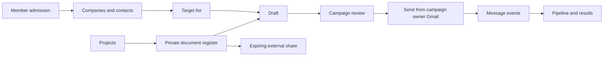

# Product system map

This document describes the current product contract in source. It is the reference for interface language, access decisions, and future integration work. It does not assert that an undeployed branch or untested external provider is live.

## Product purpose

YUCG Outreach coordinates how club members find prospective clients, prepare outreach, send from their own Google account, observe delivery outcomes, and share project material. The shared system records who did what; it must never let shared data choose another member's mailbox or reveal private project material.

## User journey and system ownership

| System | Intended job | Source of truth | Access boundary | Current interface |
| --- | --- | --- | --- | --- |
| Admission | Allow a known club member to sign in | User roster, invitation, browser-bound OAuth challenge | Exact verified email; active membership | Login, Admin → Invitations |
| Gmail connection | Let a member authorize outreach separately from identity login | Encrypted tokens on that member's user row | The connected Google identity must match the signed-in member | Profile → Integrations |
| Companies and contacts | Find, import, normalize, and review people at prospective companies | Shared contact catalog plus discovery evidence | All active members can read the shared catalog; mutations are audited | Find contacts, Target lists |
| Address evidence | Check syntax and whether a domain accepts mail without delivering a message | DNS/MX evidence and optional conservative SMTP response | Evidence is advisory; an accepted recipient command does not prove a human mailbox | Draft address status, discovery review |
| Target lists | Select companies and people for a defined outreach effort | Outreach releases, targets, people | Release owner changes the list; kept contacts enter the shared catalog | Target lists (`Slate`/`Comb` in the legacy data model) |
| Drafting | Write or generate a member-owned draft | Generated-email records keyed to member and contact | Only the member owns and changes their draft | Drafts |
| Campaigns | Freeze recipients, content, sender, and follow-up settings before delivery | Campaign, campaign-contact, immutable dispatch snapshot | Owner and authorized sender are explicit; shared reporting cannot send | Campaigns, campaign detail |
| Delivery | Claim each message once and send through the campaign owner's Gmail | Durable dispatch claims and Gmail response identifiers | No fallback to another member; ambiguous outcomes require reconciliation | Campaign detail and recovery controls |
| Message status | Attribute opens, replies, bounces, and sync health to one sent message | Outreach message and event records | Sender-scoped Gmail inspection; public pixel tokens contain no mailbox credential | Pipeline, Results, tracking status |
| Projects | Group members and material by club engagement | Projects and member assignments | Explicit membership | Projects |
| Documents | Store private, project, or club files and versions | Permission-filtered database metadata; private versioned S3 bytes | Owner writes; project/club scopes grant reads; external links expire | Documents |
| Administration | Manage membership, assignments, security settings, and audits | Users, invitations, projects, audit and usage events | Admin role | Admin |
| Operations | Inspect aggregate usage and reference material | Server-produced telemetry and stored objects | Admin role; browser telemetry cannot forge server-reserved events | Admin → Operations/Catalog |

## Important current distinctions

- An unassigned **contact** is shared club data; an assigned contact is limited to that member and administrators. A **draft**, **campaign sender**, Gmail credential, and private file are member-bound.
- An **open** means the tracking image was requested. It does not prove that the recipient personally read the message.
- A domain with a valid mail route means the domain can receive mail. It does not prove that the individual mailbox exists.
- A **document record** is authorized metadata plus an immutable S3 version. The legacy attachment library and generated-object catalog are separate stores and do not inherit document permissions.
- One server and SQLite are the current coordination model. Durable SQLite claims cover concurrent processes on that host; horizontal writers require a proven shared transactional database first.

## Runtime and data path

CloudFront is the public HTTPS edge. The current application origin is a VPC-origin EC2 instance running one non-root container with the FastAPI API and compiled Vite application. SQLite lives on retained encrypted EBS. S3 is used for the object catalog and is the intended byte store for private documents. Bedrock runs bounded draft/ranking inference. Gmail remains the mail transport.

The Assistant indexes bounded readable text from verified document versions into SQLite and retrieves only owner, current-project, or club-visible chunks. Claude Haiku receives the selected excerpts through Bedrock and returns cited, read-only guidance. See [`BEDROCK-ASSISTANT.md`](BEDROCK-ASSISTANT.md).

The cost-oriented shape is deliberate: keep one small coordinator online, keep large immutable bytes in S3, and scale compute or move transactional state only after measured concurrency requires it. Per-member application quotas are safety controls, not AWS billing limits.

## Integration status

| Provider | Current state | Product decision |
| --- | --- | --- |
| Google identity | Implemented | Keep admission separate from Gmail permission |
| Gmail | Implemented with member-specific tokens | Preserve immutable sender attribution and disconnect safety |
| Slack | Implemented, but its OAuth state needs the same durable browser binding used by Google | Do not use the current process-local state as a connector template |
| OneDrive | Legacy global-token connector | Administrative and configured-folder-only until replaced; it is not member delegated storage |
| Google Drive | Placeholder only | Do not display as an available action until delegated OAuth and import policy exist |
| S3 documents | Application path implemented; infrastructure handoff remains gated | Finish exact-origin CORS/IAM/bucket cutover and controlled browser verification |

## Known architecture blockers

1. A beta environment must declare `APP_ENV=beta` and disable email delivery at bootstrap. UI labels cannot be the safety boundary.
2. A fresh retained EBS mount must be writable by container UID/GID `10001` before SQLite starts.
3. The active document bucket needs exact-origin browser CORS, versioning, constrained application IAM, and recorded bucket provenance.
4. Gmail token refresh must not restore credentials after disconnect or deactivation.
5. Every campaign mutation, including manual status changes, must check campaign ownership.
6. Legacy pooled attachments must move into the document register before they can provide project/member visibility or durable storage.

## Large-file direction

Large files should remain out of API and email processes. The common object model should record a file's owner, project, visibility, provider, provider object/version identifier, size, content type, checksum when available, and lifecycle state.

- S3 uploads: use multipart presigning, client progress, resumable part state, completion validation, and expired-upload cleanup.
- Drive/OneDrive imports: use member-delegated OAuth, provider picker/listing scoped to allowed roots, pagination, refresh and revocation. Copy into private S3 when YUCG needs durable custody; otherwise store a permission-checked provider link with a clear external-access label.
- Email: attach only small approved document versions within Gmail's encoded message limit. Insert an expiring share link for large material. The composer must show which access policy the recipient will receive before sending.

## Evidence required before calling a system operational

- Local and hosted tests prove authorization and negative cases.
- The stage-specific aggregate check passes for the immutable commit.
- External integrations use authorized test accounts and non-sensitive fixtures.
- Terraform validation and mock tests pass; a saved live plan is reviewed separately before apply.
- Beta cannot deliver mail and never targets the production instance.
- Production requires its protected environment approval and deploys the scanned image digest.
